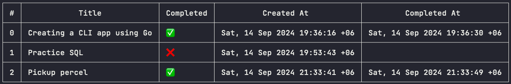

# Todo CLI App

A simple command-line interface (CLI) Todo application written in Go. This app allows you to manage your todos by adding, editing, deleting, toggling completion status, and listing all todos.



## Features

- **Add**: Add a new todo with a specified title.
- **Delete**: Delete a todo by its index.
- **Edit**: Edit an existing todo by its index and new title.
- **Toggle**: Toggle the completion status of a todo.
- **List**: List all the todos with their details (title, status, created time, completed time).

## Installation

1. Clone the repository:

   ```bash
   git clone https://github.com/muazhussain/todo-cli-app.git
   cd todo-cli-app
   ```

2. Build the application:

   ```bash
   go build -o todo ./cmd/main.go
   ```

3. Run the app:

   ```bash
   ./todo [flags]
   ```

## Usage

The CLI accepts the following flags:

| Flag           | Description                                                   | Example Usage                               |
| -------------- | ------------------------------------------------------------- | ------------------------------------------- |
| `--add`        | Add a new todo specified by a title.                          | `./todo --add="Buy groceries"`              |
| `--del`        | Delete a todo specified by its index.                         | `./todo --del=1`                            |
| `--edit`       | Edit a todo's title by its index. Format: `id:title`.         | `./todo --edit=2:Go to the gym`             |
| `--toggle`     | Toggle the completion status of a todo specified by index.    | `./todo --toggle=1`                         |
| `--list`       | List all todos with their details.                            | `./todo --list`                             |

### Example Commands

1. **Add a new todo**:

   ```bash
   ./todo --add="Read a book"
   ```

2. **Delete a todo**:

   ```bash
   ./todo --del=2
   ```

3. **Edit a todo**:

   ```bash
   ./todo --edit=1:Write a blog post
   ```

4. **Toggle a todo's completion status**:

   ```bash
   ./todo --toggle=3
   ```

5. **List all todos**:

   ```bash
   ./todo --list
   ```

## Error Handling

- If an invalid index is provided for operations like delete, toggle, or edit, the application will display an "Invalid index" message and exit.
- For the `edit` command, ensure the format `id:title` is followed. Otherwise, the app will return an error and exit.

## Project Structure

```bash
├── cmd
│   └── main.go           # Entry point of the application
├── internal
│   └── command
│       └── command.go    # Command parsing and execution logic
├── pkg
│   └── todo
│       └── todo.go       # Todo list functionality (add, delete, toggle, edit, etc.)
│   └── models
│       └── todos.go      # Stores Todos locally
|   go.mod                # Go module file
|   go.sum                # Go sum file
└── README.md 
```

## Dependencies

This project relies on the following Go package:

- [aquasecurity/table](https://github.com/aquasecurity/table) – For rendering tables in the terminal.

To install dependencies, run:

```bash
go mod tidy
```